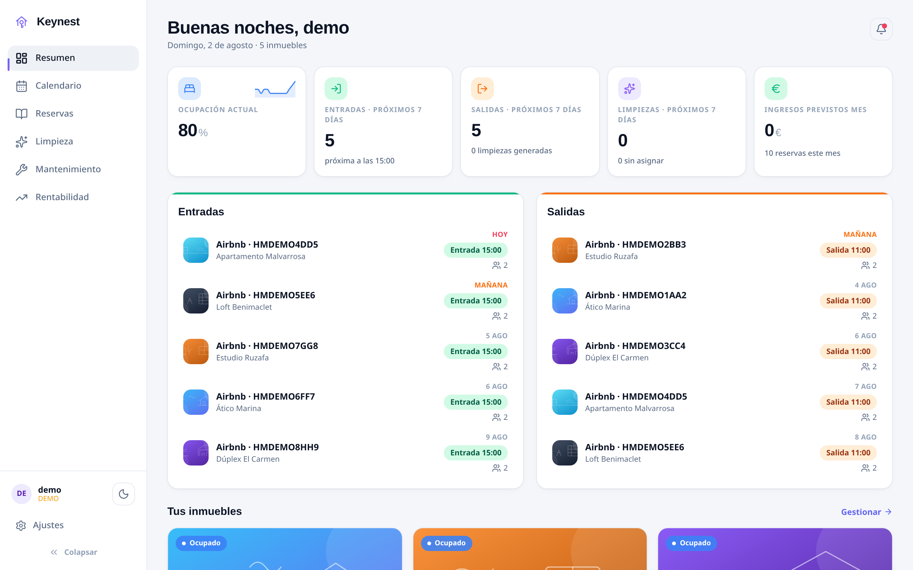
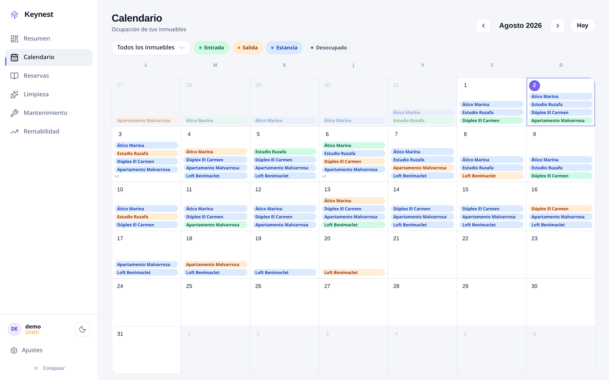
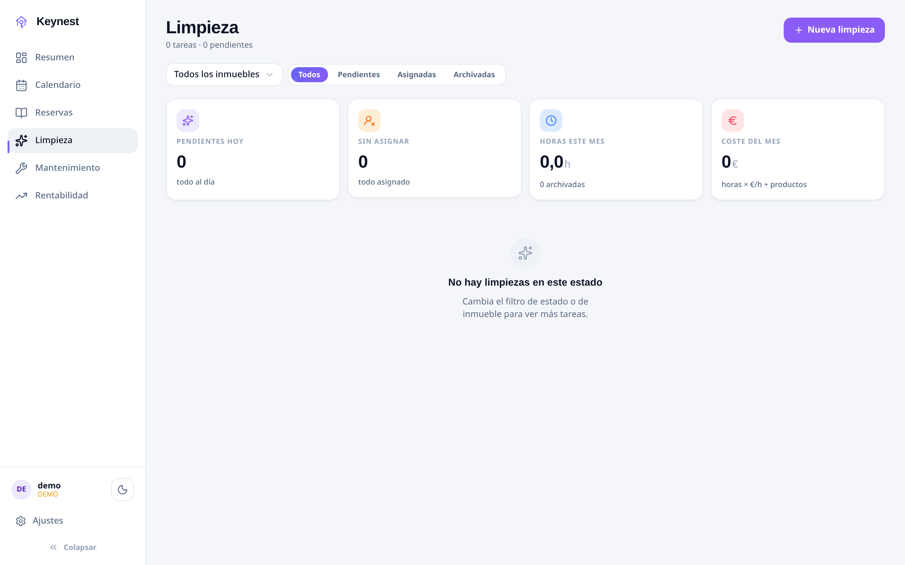
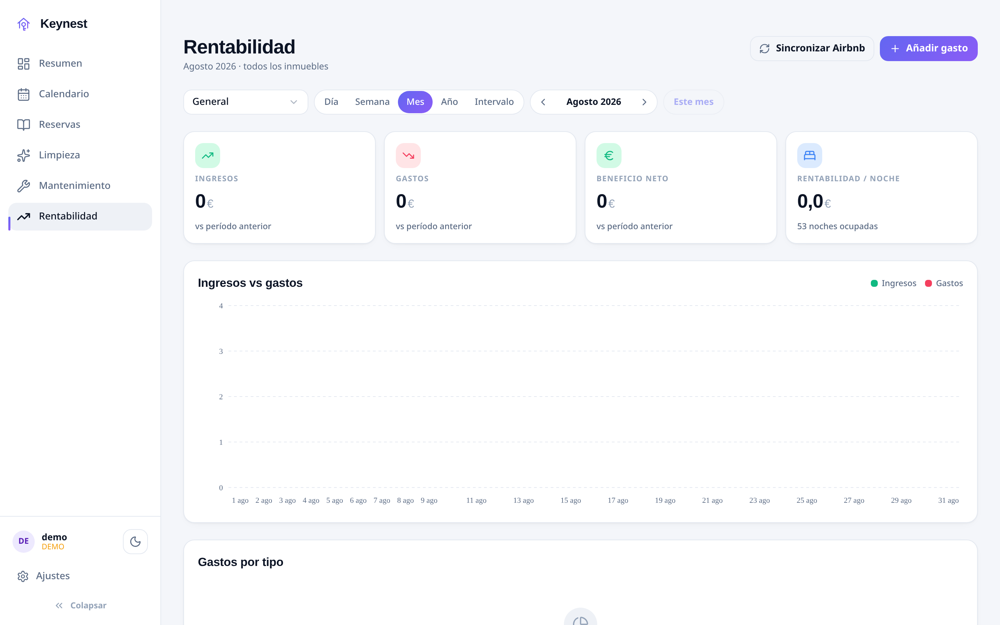

# Keynest

<p align="center">
  <a href="README.md">English</a> |
  <a href="README.es.md">Español</a>
</p>

<p align="center">
  <a href="https://keynest.cloudless.club"></a>
  <a href="https://demo.keynest.cloudless.club"></a>
  <a href="https://github.com/gnacho/keynest/releases"></a>
  <a href="https://github.com/gnacho/keynest/actions/workflows/release.yml"></a>
  <a href="LICENSE"></a>
  <a href="https://ko-fi.com/gnacho"></a>
</p>

<p align="center"><a href="https://demo.keynest.cloudless.club"><strong>Prueba la demo en vivo</strong></a> en <code>demo.keynest.cloudless.club</code></p>

<p align="center">
  <picture>
    <source media="(prefers-color-scheme: dark)" srcset="assets/hero-es-dark.png">
    <source media="(prefers-color-scheme: light)" srcset="assets/hero-es-light.png">
    
  </picture>
</p>

Keynest es una app de gestión para pequeños propietarios con alquiler de
temporada: reservas sincronizadas desde Airbnb (iCal), limpiezas generadas
desde las salidas con checklist por inmueble y enlaces por token para el
personal, tareas de mantenimiento, registro de accesos de las cerraduras y
rentabilidad por inmueble. Un único servicio Node + SQLite, autoalojado en
una caja Linux pequeña.

> **Prueba la demo en vivo**
>
> Mírala en funcionamiento sin instalar nada. Entra en **[demo.keynest.cloudless.club](https://demo.keynest.cloudless.club)** — inmuebles, reservas y limpiezas de ejemplo, sin registro. En modo de solo lectura, para que explores sin riesgo.

## ¿Por qué existe?

Keynest es una historia de familia. Mi primo se casó, se mudó con su mujer
y sus dos pisos pasaron al alquiler de temporada (de diez días a once
meses, no turístico). Un tiempo después heredaron un tercero. Lo que
empezó como "dos pisos, con un Excel se apaña" se convirtió en tardes
largas de hojas de cálculo, WhatsApps cruzados y limpiezas coordinadas de
memoria. Las apps de gestión que miramos estaban pensadas para grandes
operadores turísticos: sobredimensionadas para tres pisos, de suscripción,
y con los datos en la nube de otro. Nada de eso encajaba en una familia.
Así que construimos lo que necesitábamos: una app sencilla que cubre todo
el ciclo, crece contigo si creces, y no pide suscripción ni nube. Creo que
ha quedado bastante completa; desde luego, hoy les lleva los alquileres.

## ¿Por qué este stack?

- **Node 22 + Hono + better-sqlite3**: el trabajo es E/S (sync iCal cada
  15 minutos, fotos que sube la limpiadora desde el móvil, SSE a la UI),
  justo lo que el bucle de eventos de Node hace bien, y Hono no estorba.
- **SQLite, sin base de datos externa**: un fichero en `/var/lib/keynest`,
  modo WAL. Para unos pocos inmuebles y usuarios no hay nada que
  administrar, y un backup es copiar un archivo.
- **systemd, sin Docker**: corre en un LXC pequeño; el instalador deja
  releases estilo capistrano y actualizar es mover un symlink (Docker
  añade una capa sin aportar nada aquí).
- **PWA React 19 + Vite + Tailwind**: instalable en el móvil, que es donde
  la limpiadora y mi primo la usan de verdad; la shell de UI es compartida
  con mis otras apps, así que un arreglo llega a todas a la vez.

## Características

- **Reservas**: sync iCal automático desde Airbnb (cada 15 min + manual),
  calendario con semántica de color entrada/salida/estancia, importe y
  notas manuales por reserva.
- **Limpiezas**: creadas desde las salidas (nunca en fechas ocupadas,
  margen configurable), instrucciones y checklist por inmueble, hasta 2
  personas asignadas, **enlaces por token para el personal** (sin cuenta),
  fotos desde el móvil, coste calculado de horas × tarifa + materiales.
- **Mantenimiento**: kanban con arrastrar y soltar, categorías, flag de
  urgente ligado a la próxima desocupación.
- **Cerraduras**: registro de accesos Tedee (quién, cuándo, qué inmueble),
  batería y estado online.
- **Rentabilidad**: ingresos vs gastos por inmueble y por mes, comparativa
  con el período anterior, tipos de gasto recurrente.
- **Multi-idioma**: UI completa ES/EN, idioma por usuario (`auto` =
  navegador).
- **Auth**: multiusuario con sesiones bcrypt, modo demo (datos de muestra
  con un clic, BD aparte, desactivable).
- **Autoalojado**: un único proceso Node + SQLite, servicio systemd
  endurecido.

## Capturas

**Calendario: entradas en verde, salidas en naranja, estancias en azul**

<picture>
  <source media="(prefers-color-scheme: dark)" srcset="assets/screenshot-calendar-es-dark.png">
  <source media="(prefers-color-scheme: light)" srcset="assets/screenshot-calendar-es-light.png">
  
</picture>

**Limpiezas: tareas desde las salidas, checklist y coste por inmueble**

<picture>
  <source media="(prefers-color-scheme: dark)" srcset="assets/screenshot-cleaning-es-dark.png">
  <source media="(prefers-color-scheme: light)" srcset="assets/screenshot-cleaning-es-light.png">
  
</picture>

**Rentabilidad: ingresos vs gastos por inmueble**

<picture>
  <source media="(prefers-color-scheme: dark)" srcset="assets/screenshot-profit-es-dark.png">
  <source media="(prefers-color-scheme: light)" srcset="assets/screenshot-profit-es-light.png">
  
</picture>

## Instalación

Requisitos: Linux (x86_64 o arm64) con systemd.

```sh
curl -fsSL https://raw.githubusercontent.com/gnacho/keynest/main/install.sh | sh   # (recomendado)
```

El instalador es shell plano y legible: [inspecciónalo primero](install.sh).
Instala el runtime Node 22 versionado y la última release (frontend
precompilado, `node_modules` de producción por arquitectura, sin compilador
en el servidor) como servicio systemd enjaulado bajo `/opt/keynest`, estilo
capistrano (`releases/` + symlink `current`). Los datos viven en
`/var/lib/keynest`, la config en `/etc/keynest/env` (0600) con una
contraseña de admin aleatoria mostrada una vez. Si el puerto por defecto
(8081) está ocupado, se elige el siguiente libre automáticamente. Cada
descarga se verifica contra `checksums.txt` (sha256).

Vuelve a ejecutar el script para actualizar; `--uninstall` lo quita limpio
(datos conservados, `--purge` los borra).

## Configuración

El servicio lee su entorno (instalador: `/etc/keynest/env`):

| Variable | Default | Descripción |
| -------- | ------- | ----------- |
| `PORT` | `8081` | Puerto de escucha. |
| `DATA_DIR` | `/var/lib/keynest` | Ficheros SQLite + uploads. |
| `STATIC_DIR` | `/opt/keynest/current/dist` | Frontend compilado a servir. |
| `AUTH_USER` / `AUTH_PASS` | - | Admin de arranque en el primer boot. |
| `SYNC_INTERVAL_MS` | `900000` | Intervalo de sync iCal (mín 60000). |

Reinicia tras cambios: `sudo systemctl restart keynest`.

## Desarrollo

```bash
# Backend (API + servidor estático)
cd server
npm install
cp .env.example .env   # ajusta AUTH_USER / AUTH_PASS
npm start

# Frontend (dev server)
cd app
npm install
npm run dev

# Tests y lint
cd server && npm test
cd app && npm run lint
```

## Despliegue

Layout de producción: `/opt/keynest/{server,public,data}` con unit systemd
endurecida (`ProtectSystem=full`, `ReadWritePaths` solo para `data/`). Ver
`.github/workflows/deploy.yml` para el pipeline automatizado (push a
`main` → tests → build → despliegue SSH). Los tarballs estables por
arquitectura los construye `.github/workflows/release.yml` en tags `v*`.

## Licencia

[AGPL-3.0](LICENSE)
