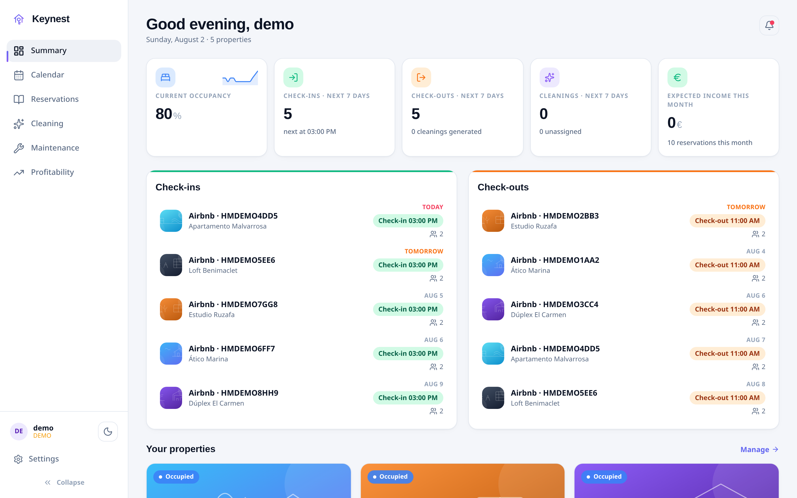
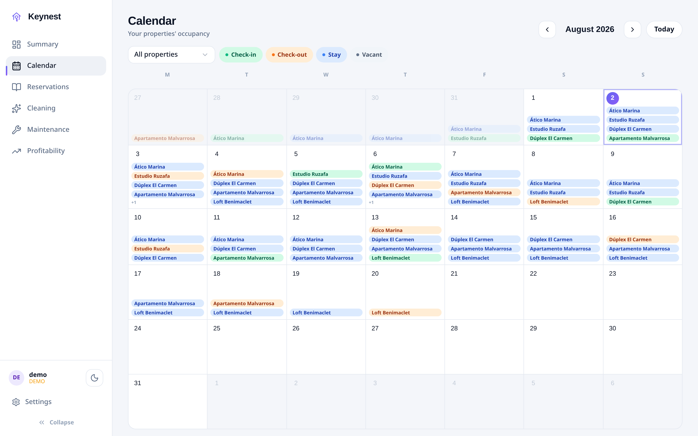
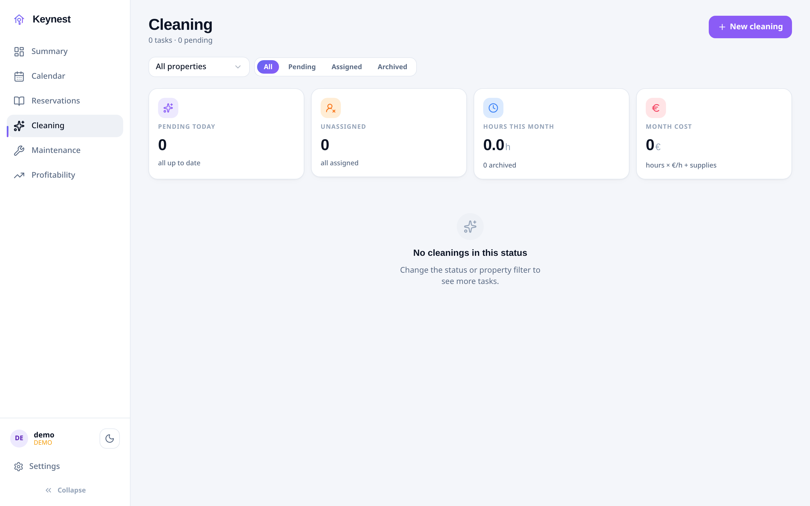
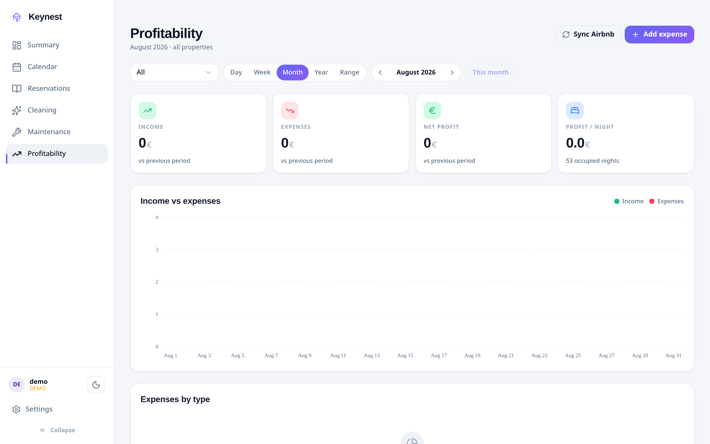

# Keynest

<p align="center">
  <a href="README.md">English</a> |
  <a href="README.es.md">Español</a>
</p>

<p align="center">
  <a href="https://keynest.cloudless.club"></a>
  <a href="https://demo.keynest.cloudless.club"></a>
  <a href="https://github.com/gnacho/keynest/releases"></a>
  <a href="https://github.com/gnacho/keynest/actions/workflows/release.yml"></a>
  <a href="LICENSE"></a>
  <a href="https://ko-fi.com/gnacho"></a>
</p>

<p align="center">
  <picture>
    <source media="(prefers-color-scheme: dark)" srcset="assets/hero-en-dark.png">
    <source media="(prefers-color-scheme: light)" srcset="assets/hero-en-light.png">
    
  </picture>
</p>

Keynest is a property-management app for small landlords with mid-term
rentals: reservations synced from Airbnb (iCal), cleanings generated from
check-outs with per-property checklists and token links for staff,
maintenance tasks, smart-lock access logs and per-property profitability.
One Node + SQLite service, self-hosted on a small Linux box.

## Why does this exist?

Keynest is a family story. My cousin got married, moved in with his wife,
and their two flats went up for mid-term rent (ten days to eleven months,
not tourist stays). A while later they inherited a third one. What started
as "two flats, a spreadsheet will do" turned into long evenings of Excel
files, crossed WhatsApp threads and cleanings coordinated by memory. The
management apps we looked at were built for big tourist operators:
oversized for three flats, subscription-priced, and with the data on
somebody else's cloud. None of that fit a family. So we built the thing we
needed: a simple app that covers the whole loop, grows with you if you
grow, and asks for no subscription and no cloud. I think it's quite
complete now; it certainly runs their rentals today.

## Why this stack?

- **Node 22 + Hono + better-sqlite3**: the work is I/O (iCal sync every
  15 minutes, uploads from the cleaner's phone, SSE to the UI), exactly
  what Node's event loop is good at, and Hono stays out of the way.
- **SQLite, no external database**: one file under `/var/lib/keynest`,
  WAL mode. For a handful of properties and users there is nothing to
  administer, and a backup is copying one file.
- **systemd, no Docker**: it runs in a small LXC; the installer lays out
  capistrano-style releases and updates are a symlink swap (Docker adds a
  layer without adding anything here).
- **React 19 + Vite + Tailwind PWA**: installable on the phone, which is
  where the cleaner and my cousin actually use it; the UI shell is shared
  with my other apps, so fixes land everywhere at once.

## Features

- **Reservations**: automatic iCal sync from Airbnb (every 15 min +
  manual), calendar with check-in/check-out/stay color semantics, manual
  amount and notes per reservation.
- **Cleanings**: created from check-outs (never on occupied dates,
  configurable margin), per-property instructions and checklist, up to 2
  cleaners assigned, **token links for staff** (no account needed), photos
  from the staff's phone, cost computed from hours × rate + supplies.
- **Maintenance**: kanban with drag & drop, categories, urgent flag tied to
  the next vacancy.
- **Smart locks**: Tedee access log (who, when, which property), battery
  and online status.
- **Profitability**: income vs expenses per property and per month,
  comparison with the previous period, recurring expense types.
- **Multi-language**: full ES/EN UI, per-user language (`auto` = browser).
- **Auth**: multi-user with bcrypt sessions, demo mode (one-click sample
  data, separate DB, toggleable).
- **Self-hosted**: single Node process + SQLite, hardened systemd service.

## Screenshots

**Calendar: check-ins in green, check-outs in orange, stays in blue**

<picture>
  <source media="(prefers-color-scheme: dark)" srcset="assets/screenshot-calendar-en-dark.png">
  <source media="(prefers-color-scheme: light)" srcset="assets/screenshot-calendar-en-light.png">
  
</picture>

**Cleanings: tasks from check-outs, checklist and cost per property**

<picture>
  <source media="(prefers-color-scheme: dark)" srcset="assets/screenshot-cleaning-en-dark.png">
  <source media="(prefers-color-scheme: light)" srcset="assets/screenshot-cleaning-en-light.png">
  
</picture>

**Profitability: income vs expenses per property**

<picture>
  <source media="(prefers-color-scheme: dark)" srcset="assets/screenshot-profit-en-dark.png">
  <source media="(prefers-color-scheme: light)" srcset="assets/screenshot-profit-en-light.png">
  
</picture>

## Installation

Requirements: Linux (x86_64 or arm64) with systemd.

```sh
curl -fsSL https://raw.githubusercontent.com/gnacho/keynest/main/install.sh | sh   # (recommended)
```

The installer is plain, readable shell: [inspect it first](install.sh). It
installs the versioned Node 22 runtime and the latest release (frontend
pre-built, production `node_modules` per arch, no compiler needed on the
server) as a sandboxed systemd service under `/opt/keynest`, capistrano-style
(`releases/` + `current` symlink). Data lives in `/var/lib/keynest`, config
in `/etc/keynest/env` (0600) with a random admin password shown once. If
the default port (8081) is busy, the next free one is picked automatically.
Every download is verified against `checksums.txt` (sha256).

Re-run the script to update; `--uninstall` removes it cleanly (data kept,
`--purge` wipes).

## Configuration

The service reads its environment (installer: `/etc/keynest/env`):

| Variable | Default | Description |
| -------- | ------- | ----------- |
| `PORT` | `8081` | Listen port. |
| `DATA_DIR` | `/var/lib/keynest` | SQLite files + uploads. |
| `STATIC_DIR` | `/opt/keynest/current/dist` | Built frontend to serve. |
| `AUTH_USER` / `AUTH_PASS` | - | Bootstrap admin on first boot. |
| `SYNC_INTERVAL_MS` | `900000` | iCal sync interval (min 60000). |

Restart after changes: `sudo systemctl restart keynest`.

## Development

```bash
# Backend (API + static server)
cd server
npm install
cp .env.example .env   # set AUTH_USER / AUTH_PASS
npm start

# Frontend (dev server)
cd app
npm install
npm run dev

# Tests & lint
cd server && npm test
cd app && npm run lint
```

## Deploy

Production layout: `/opt/keynest/{server,public,data}` with a hardened
systemd unit (`ProtectSystem=full`, `ReadWritePaths` only for `data/`).
See `.github/workflows/deploy.yml` for the automated pipeline (push to
`main` → tests → build → SSH deploy). Stable per-arch tarballs are built by
`.github/workflows/release.yml` on tags `v*`.

## License

[AGPL-3.0](LICENSE)
